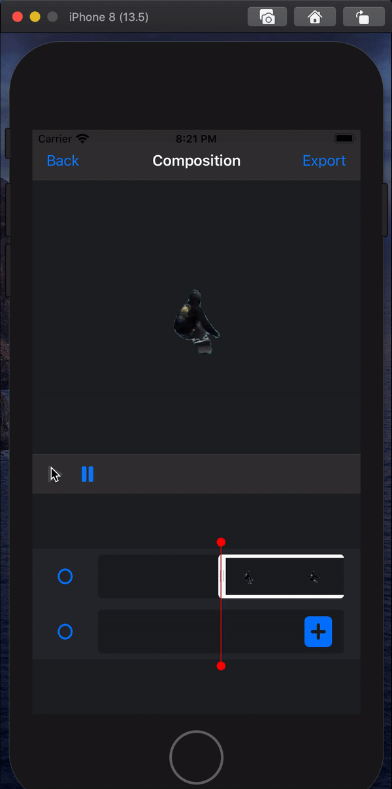

# VOS_IOS

IOS demo using object and video segmentation network.

## Demo GIF

- **Segment foreground object** in the first frame with 4 extreme points.

- **Generate segmentation results** for the entire video with VOS model.

- **Composite** foreground object into another video.

